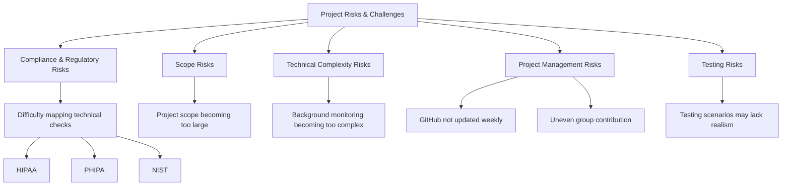

# Healthcare Data Security Compliance Checker

## Overview

The **Healthcare Data Security Compliance Checker** is a cybersecurity and compliance support tool designed to help healthcare organizations evaluate whether important safeguards are properly implemented to protect:

- Electronic Health Records (EHRs)
- Protected Health Information (PHI)
- Related healthcare systems

The tool **does not process, collect, or store live patient health information**. Instead, it evaluates selected system configurations, security practices, access-related metadata, and simulated evidence to determine whether safeguards align with healthcare security expectations.

The system is intended to operate as a **lightweight background monitoring and compliance support tool** while healthcare professionals access PHI systems. It evaluates:

- Login attempts
- MFA status
- Role-based access controls
- Audit log availability
- Encryption status
- Backup protection
- Cybersecurity training readiness
- Suspicious access indicators

The tool compares these indicators against healthcare security control requirements and generates:

- Plain-language reports
- Technical reports
- Risk levels
- Compliance gaps
- Supporting evidence
- Remediation recommendations

Phase 2 expands the project from a **basic compliance questionnaire** toward a more **evidence-based, context-aware, and privacy-preserving compliance checker**.

Each finding is connected to:

- User role
- Access behaviour
- System configuration evidence
- Safeguard category
- CIA triad impact
- Related compliance control areas

---

# Core Safeguards Evaluated

The project focuses on eight major safeguard categories:

1. Access control  
2. Encryption & transmission security  
3. Logging & audit controls  
4. Backup, recovery & contingency planning  
5. PHI access behaviour monitoring  
6. EHR security safeguards  
7. Cybersecurity awareness & training readiness  
8. Usability, privacy, data integrity & continuous improvement  

---

# Features

## Compliance Validation

The system evaluates security controls related to:

- Access Control
- Encryption
- Audit Logging
- Backup Protection
- Password Policies

---

## Evidence-Based Assessment

The tool analyzes simulated system evidence including:

- Configuration settings
- Authentication settings
- Logs
- Security indicators

---

## Risk Scoring

Weighted compliance scoring based on severity of failed controls.

### Risk Levels:

- Low Risk
- Medium Risk
- High Risk

---

## Security Monitoring

Includes basic attack detection such as:

- Multiple failed login detection
- Suspicious access alerts
- Security alert generation

---

## Dashboard Reporting

Results displayed through a dashboard containing:

- Compliance score
- Security alerts
- Evidence tracking
- Risk summaries
- Remediation recommendations

---

# Group Roles & Responsibilities

```text
Project Team
│
├── Carleen — Research & Compliance Lead
│   ├── HIPAA / PHIPA / NIST mapping
│   ├── Documentation
│   ├── Testing scenarios
│   ├── Report writing
│   └── Privacy & usability review
│
├── Kasi — Technical & Prototype Lead
│   ├── Code implementation
│   ├── Streamlit interface
│   ├── Monitoring logic
│   └── Risk scoring
│
└── Hartej — Project Management & Presentation Lead
    ├── Weekly coordination
    ├── GitHub evidence diagrams
    └── Integration support
```

---

# Updated Scope & Limitations

## In Scope

The Phase 2 implementation includes:

- Streamlit or Python-based user interface
- Expanded control bank
- HIPAA / PHIPA / NIST mapping
- Administrative, physical & technical safeguards
- CIA triad mapping
- PHI access behaviour monitoring using simulated logs
- Training readiness checks
- Data integrity checks
- Incident response readiness checks
- Business continuity & backup checks
- Risk scoring
- Plain-language and technical reporting
- GitHub documentation & weekly updates
- Testing using multiple healthcare scenarios

---

## Out of Scope (Phase 2)

The following are intentionally excluded:

- Live EHR integration
- Real patient data collection
- Real-time production monitoring
- Full machine learning anomaly detection
- Full SIEM integration
- Full firewall / antivirus API integration
- Real PHI storage
- Full blockchain implementation

---

## Implementation Constraints

Because the project has approximately **4 months for implementation** and **no access to real PHI**, the system will use:

- Simulated healthcare access logs
- Generated testing scenarios
- Sample configuration values
- Manually entered security evidence

This keeps the project realistic while demonstrating how the tool would function within a healthcare environment.

---

# Risks & Challenges



---

# Final Statement

Phase 2 moves the **Healthcare Data Security Compliance Checker** beyond a basic questionnaire toward a:

- Privacy-preserving system
- Evidence-based compliance checker
- Context-aware healthcare cybersecurity support tool

The implementation remains realistic for a **4-month development period** by relying on:

- Simulated metadata
- Sample logs
- Rule-based detection
- Structured control mapping

rather than:

- Live PHI
- Live EHR integration
- Production monitoring

Additional capabilities introduced include:

- EHR safeguard mapping
- CIA triad impact analysis
- Cybersecurity training readiness
- Data integrity checks
- Incident response readiness
- Plain-language reporting

The goal is to support **smaller healthcare organizations** that require practical and understandable cybersecurity compliance guidance.

---

# Project Structure

```bash
Healthcare-Compliance-Checker/
│
├── checker.py
├── control_bank.json
├── system_data.json
├── report.html
├── README.md
│
└── docs/
    ├── diagrams/
    ├── testing/
    └── reports/
```

---

# Technologies

- Python
- Streamlit
- JSON
- HTML Reporting
- GitHub Documentation
- Rule-based Risk Scoring

---

# Future Enhancements

Potential future expansions:

- EHR integration
- SIEM integration
- API-based monitoring
- Machine learning anomaly detection
- Enhanced automation
- Enterprise compliance dashboards
