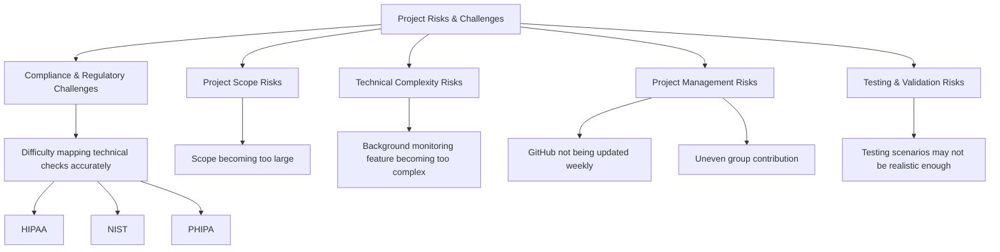

# Healthcare Data Security Compliance Checker

## Overview

The Healthcare Data Security Compliance Checker is a cybersecurity and compliance support
tool designed to help healthcare organizations evaluate whether important safeguards are properly
implemented to protect electronic health records (EHRs), protected health information (PHI), and
related healthcare systems.The tool focuses on healthcare data security requirements and does not
process, collect, or store live patient health information. Instead, it evaluates selected system
configurations, security practices, access-related metadata, and simulated evidence to determine
whether safeguards align with healthcare security expectations.
The tool is intended to operate as a lightweight background monitoring and compliance
support system while healthcare professionals access PHI systems. It collects security-related
metadata such as login attempts, MFA status, role-based access status, audit log availability,
encryption status, backup protection, cybersecurity training readiness, and suspicious access
indicators. It then evaluates these signals against healthcare security control requirements and
generates plain-language and technical reports showing risk level, compliance gaps, supporting
evidence, and remediation recommendations.
The revised Phase 2 version will move the project from a basic compliance questionnaire
toward a more evidence-based, context-aware, and privacy-preserving compliance checker. Each
finding will be connected to the user’s role, access behaviour, system configuration evidence,
safeguard type, CIA triad impact, and related compliance control area.
The project is focused on eight main safeguards:
1. Access control
2. Encryption and transmission security
3. Logging and audit controls
4. Backup, recovery and contingency planning
5. PHI access behaviour monitoring
6. EHR security safeguards
7. Cybersecurity awareness and training readiness
8. Useability, privacy, data integrity, and continuous improvement
Our goal throughout phase 2 is to improve the existing prototype into a more complete and
realistic compliance checker for smaller or privately funded healthcare organizations that may not
have access to expensive enterprise compliance platforms. The prototype will be expanded into a
more complete system with a stronger control bank, improved UI, better reporting, training readiness
checks, data integrity checks, and healthcare related risk scenarios.


---

# Features

## Compliance Validation
The system evaluates security controls related to:

- Access Control
- Encryption
- Audit Logging
- Backup Protection
- Password Policies

---

## Evidence-Based Assessment
The tool analyzes simulated system evidence including:

- Configuration settings
- Authentication settings
- Logs
- Security indicators

---

## Risk Scoring
The checker calculates a weighted compliance score based on the severity of failed controls.

Risk Levels:
- Low Risk
- Medium Risk
- High Risk

---

## Security Monitoring
The system includes basic attack detection capabilities such as:

- Multiple failed login detection
- Suspicious access alerts
- Security alert generation

---

## Dashboard Report
Results are displayed through a professional HTML dashboard containing:

- Compliance score
- Security alerts
- Evidence tracking
- Remediation recommendations
- Risk assessment summary

---
## Group Roles & Responsibilities
Project Team
├── Carleen — Research & Compliance Lead
│   ├── HIPAA / PHIPA / NIST mapping
│   ├── Documentation
│   ├── Testing scenarios
│   ├── Report writing
│   └── Privacy & usability review
│
├── Kasi — Technical & Prototype Lead
│   ├── Code implementation
│   ├── Streamlit interface
│   ├── Monitoring logic
│   └── Risk scoring
│
└── Hartej — Project Management & Presentation Lead
    ├── Weekly coordination
    ├── GitHub evidence diagrams
    └── Integration support
# Risks & Challenges:

# Final Statement
Overall, Phase 2 will move the Healthcare Data Security Compliance Checker from a basic
compliance questionnaire toward a lightweight, privacy-preserving, evidence-based compliance
support system. The tool will remain realistic for a four month implementation period by using
simulated metadata, sample logs, structured control mappings, and rule-based detection instead of live PHI or EHR integration. By adding EHR safeguard mapping, CIA triad impact, cybersecurity training readiness, data integrity checks, incident response readiness, and plain-language reporting, the tool will better support smaller healthcare organizations that need practical and understandable cybersecurity compliance guidance.

# Project Structure

```bash
Healthcare-Compliance-Checker/
│
├── checker.py
├── control_bank.json
├── system_data.json
├── report.html
└── README.md

---


